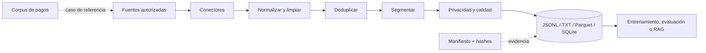

# 🏭 AI Dataset Foundry · Payment Systems Knowledge Lab

## De fuentes heterogéneas a datasets auditables, con sistemas de pago como caso de referencia

[](https://github.com/vladimiracunadev-create/ai-dataset-foundry/actions/workflows/ci.yml)
[](https://github.com/vladimiracunadev-create/ai-dataset-foundry/actions/workflows/pages.yml)
[](https://www.python.org/)
[](LICENSE)

**AI Dataset Foundry** es un pipeline local-first para construir corpus trazables antes de entrenar, ajustar o conectar modelos mediante RAG. El repositorio incorpora un **laboratorio de conocimiento sobre pagos**: una taxonomía amplia de instrumentos, rails, actores, mensajes, controles y operación que permite estudiar cómo funciona un pago real sin confundir una simulación educativa con un gateway certificado.

[🌐 Sitio](https://vladimiracunadev-create.github.io/ai-dataset-foundry/) · [⚡ Inicio rápido](#-inicio-rápido) · [💳 Atlas de pagos](docs/PAYMENT_METHODS.md) · [🏗️ Arquitectura](docs/ARCHITECTURE.md) · [🛡️ Seguridad](docs/SECURITY_MODEL.md) · [✅ Estado](STATUS.md)

> [!IMPORTANT]
> Este repositorio es una demo educativa y una herramienta de ingeniería de datos. **No mueve dinero, no almacena PAN/CVV, no es un PSP, adquirente, emisor, cámara ni sistema de liquidación**, y no sustituye asesoría legal, regulatoria, contable, tributaria o de seguridad. Las integraciones reales exigen contratos, credenciales de sandbox, certificaciones y controles propios del proveedor y de la jurisdicción.

## 🎯 Qué demuestra

| Superficie | Evidencia verificable |
| --- | --- |
| Pipeline | ingesta → normalización → limpieza → deduplicación → chunking → calidad → exportación |
| Fuentes | texto/Markdown, PDF, DOCX, HTML, URL, Git, JSON/JSONL y CSV |
| Salidas | JSONL, TXT, Parquet, manifiesto y catálogo SQLite |
| Trazabilidad | identificadores estables, SHA-256 de fuente y contenido, metadatos y motivos de rechazo |
| Pagos | atlas de 9 familias y 40 variantes, con ciclo, riesgos, conciliación y tecnologías relacionadas |
| Alcance real | motor operativo local; contenido de pagos documentado; conexiones externas no implementadas |
| Calidad | 7 pruebas automatizadas en 5 archivos; CI en Python 3.11, 3.12 y 3.13 |

Detalle y método de verificación: [`STATUS.md`](STATUS.md).

## 🧭 Mapa del sistema



La foundry y el dominio de pagos están separados deliberadamente: el motor no necesita conocer tarjetas o transferencias; el corpus conserva procedencia, contexto y vocabulario del dominio.

## 💳 Cobertura del laboratorio de pagos

El atlas organiza los medios por **instrumento**, **canal**, **rail** y **modelo de liquidación**; evita el error frecuente de llamar «medio de pago» a todo.

| Familia | Incluye |
| --- | --- |
| Efectivo y equivalentes | billetes, monedas, contra entrega, vouchers y stored value cerrado |
| Papel | cheque, vale vista/cashier's check, giro y money order |
| Tarjetas | crédito, débito, prepago, charge, commercial, virtual, contactless y card-on-file |
| Cuenta a cuenta | TEF, ACH, débito directo, transferencias inmediatas, wire y RTGS |
| Billeteras | wallets pass-through, saldo almacenado, super-app, NFC, QR y wearables |
| Crédito en checkout | cuotas del emisor, BNPL, financiamiento POS y pay-later B2B |
| Cobro remoto | payment link, invoice payment, QR, USSD, carrier billing y pago en agente/corresponsal |
| Transfronterizo | corresponsalía, SWIFT, remesas, FX, adquirencia local y cross-border acquiring |
| Activos digitales | criptoactivos, stablecoins, CBDC y dinero tokenizado, con límites regulatorios explícitos |

La matriz completa, incluidos actores, finalidades, reversibilidad y riesgos, está en [`docs/PAYMENT_METHODS.md`](docs/PAYMENT_METHODS.md). El flujo end-to-end está en [`docs/PAYMENT_LIFECYCLE.md`](docs/PAYMENT_LIFECYCLE.md).

## ⚡ Inicio rápido

Requisitos: Python 3.11 o superior y Git. Parquet, PDF, DOCX y Web son extras opcionales.

```bash
python -m venv .venv
```

```bash
# Linux/macOS
source .venv/bin/activate

# Windows PowerShell
.venv\Scripts\Activate.ps1
```

```bash
python -m pip install --upgrade pip
python -m pip install -e ".[all,dev]"
python scripts/doctor.py
python scripts/smoke.py
```

Construir el caso de referencia de pagos:

```bash
foundry build --config examples/payments.yaml
foundry stats work/payments-lab/dataset.jsonl
```

O ejecutar el ejemplo mínimo:

```bash
foundry build examples/sample.txt --out work/demo --format jsonl
```

El pipeline **no sobrescribe los originales**. Cada ejecución produce artefactos derivados y un `manifest.json` que documenta entradas, configuración, conteos, errores y salidas.

## 🧪 Ruta pedagógica

1. Lee [`docs/PAYMENTS_PRIMER.md`](docs/PAYMENTS_PRIMER.md) para separar instrumento, canal, rail, esquema, clearing y settlement.
2. Recorre [`docs/PAYMENT_METHODS.md`](docs/PAYMENT_METHODS.md) y selecciona dos familias con propiedades distintas.
3. Sigue una compra en [`docs/PAYMENT_LIFECYCLE.md`](docs/PAYMENT_LIFECYCLE.md), desde la intención hasta la conciliación.
4. Modela estados e idempotencia con [`docs/INTEGRATION_PLAYBOOK.md`](docs/INTEGRATION_PLAYBOOK.md).
5. Diseña controles con [`docs/SECURITY_MODEL.md`](docs/SECURITY_MODEL.md) y [`docs/RISK_AND_COMPLIANCE.md`](docs/RISK_AND_COMPLIANCE.md).
6. Opera incidentes, liquidación y disputas con [`docs/OPERATIONS.md`](docs/OPERATIONS.md).
7. Ejecuta la foundry sobre `examples/payments-corpus/` y audita el manifiesto resultante.

## 🏗️ Decisiones de producción que el laboratorio enseña

- El pedido, el intento, la autorización, la captura, el movimiento de fondos y el asiento contable son entidades distintas.
- «HTTP 200» no significa «dinero liquidado»; el estado definitivo depende del rail y puede cambiar por devolución o disputa.
- Toda operación mutante necesita idempotencia, claves de correlación y una máquina de estados persistente.
- Los webhooks son mensajes no confiables hasta verificar firma, timestamp, replay y correspondencia con una consulta autenticada.
- La conciliación y el ledger son parte del producto, no tareas administrativas posteriores.
- La minimización de datos reduce alcance PCI, superficie de fraude y costo operativo.
- Un medio alternativo no es «otra tarjeta»: cambian finality, reembolsos, identidad, mensajes, disponibilidad y riesgo.

## 🗂️ Documentación por audiencia

| Quiero… | Documento |
| --- | --- |
| entender el proyecto en 10 minutos | [`README.md`](README.md) |
| comprobar qué existe de verdad | [`STATUS.md`](STATUS.md) |
| comprender pagos desde cero | [`docs/PAYMENTS_PRIMER.md`](docs/PAYMENTS_PRIMER.md) |
| comparar todos los medios cubiertos | [`docs/PAYMENT_METHODS.md`](docs/PAYMENT_METHODS.md) |
| seguir autorización, clearing y settlement | [`docs/PAYMENT_LIFECYCLE.md`](docs/PAYMENT_LIFECYCLE.md) |
| diseñar servicios y contratos | [`docs/ARCHITECTURE.md`](docs/ARCHITECTURE.md) |
| integrar un PSP sin errores clásicos | [`docs/INTEGRATION_PLAYBOOK.md`](docs/INTEGRATION_PLAYBOOK.md) |
| operar pagos, disputas y conciliación | [`docs/OPERATIONS.md`](docs/OPERATIONS.md) |
| tratar seguridad, fraude y compliance | [`docs/SECURITY_MODEL.md`](docs/SECURITY_MODEL.md) · [`docs/RISK_AND_COMPLIANCE.md`](docs/RISK_AND_COMPLIANCE.md) |
| conocer el contrato de datos | [`docs/DATASET_SCHEMA.md`](docs/DATASET_SCHEMA.md) |
| configurar la foundry | [`docs/CONFIGURATION.md`](docs/CONFIGURATION.md) |
| revisar términos y fuentes | [`docs/GLOSSARY.md`](docs/GLOSSARY.md) · [`docs/REFERENCES.md`](docs/REFERENCES.md) |

## 🛡️ Seguridad, privacidad y derechos

Nunca ingieras PAN, CVV/CVC, PIN, track data, llaves privadas, secretos de API ni datos reales de clientes. Los ejemplos son sintéticos. El detector incluido es deliberadamente liviano y **no equivale a DLP, PCI DSS, AML/KYC ni evaluación de fraude**. Lee [`SECURITY.md`](SECURITY.md), [`docs/GOVERNANCE.md`](docs/GOVERNANCE.md) y el modelo de amenazas antes de utilizar fuentes internas.

## 🧩 Extender el motor

- Nuevo conector: impleméntalo bajo `src/ai_dataset_foundry/connectors/` y regístralo en `router.py`.
- Nuevo exportador: agrégalo bajo `exporters/` y regístralo en `exporters/__init__.py`.
- Nueva política de calidad: mantenla determinista, explica sus falsos positivos/negativos y añade pruebas.
- Integración con PSP: mantenla fuera del núcleo de ingesta y usa exclusivamente sandbox con datos sintéticos.

Consulta [`CONTRIBUTING.md`](CONTRIBUTING.md) y [`docs/ARCHITECTURE.md`](docs/ARCHITECTURE.md).

## 📜 Licencia y atribución

Código y documentación bajo [MIT](LICENSE). Los nombres de redes, esquemas, proveedores y estándares pertenecen a sus respectivos titulares y se usan con fines descriptivos. Las fuentes normativas y técnicas se enlazan, no se redistribuyen.

---

Hecho con criterio de producción por [Vladimir Acuña](https://github.com/vladimiracunadev-create). Estado documental verificado: **7 de septiembre de 2026**.
