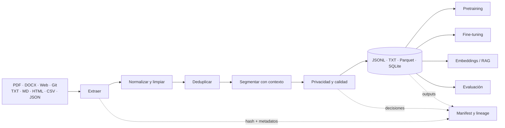

# 🏭 AI Dataset Foundry

## De documentos dispersos a datasets auditables para redes neuronales, fine-tuning y RAG

[](https://github.com/vladimiracunadev-create/ai-dataset-foundry/actions/workflows/ci.yml)
[](https://github.com/vladimiracunadev-create/ai-dataset-foundry/actions/workflows/security.yml)
[](https://github.com/vladimiracunadev-create/ai-dataset-foundry/actions/workflows/pages.yml)
[](https://github.com/vladimiracunadev-create/ai-dataset-foundry/releases)
[](https://www.python.org/)
[](LICENSE)

**AI Dataset Foundry** es un pipeline local-first que adquiere contenido desde archivos, web y repositorios; lo normaliza, limpia, deduplica, segmenta y valida; conserva lineage hasta la fuente; y exporta corpus reutilizables por sistemas de aprendizaje automático.

[🌐 Sitio](https://vladimiracunadev-create.github.io/ai-dataset-foundry/) · [⬇️ Windows y Android](https://github.com/vladimiracunadev-create/ai-dataset-foundry/releases) · [⚡ Ejecutar](#-inicio-rápido) · [📚 Guía completa](docs/GETTING_STARTED.md) · [✅ Estado verificable](STATUS.md) · [🧭 Roadmap](ROADMAP.md)

> [!IMPORTANT]
> Esta herramienta **prepara datasets; no entrena modelos**. Un archivo extraído no se vuelve automáticamente verdadero, legal, representativo ni apto para aprendizaje. La foundry aporta trazabilidad y controles técnicos; la autorización, curación de dominio, evaluación y decisión de uso siguen siendo humanas.

## 🎯 El problema que resuelve

El conocimiento útil rara vez llega en el formato que espera un modelo. Está repartido entre manuales PDF, documentos Word, páginas web, repositorios, Markdown, CSV y JSON; contiene duplicados, menús, saltos rotos, secretos, versiones contradictorias y fragmentos sin contexto.

La foundry convierte ese material en un contrato común:



## ✅ Estado verificable · v0.2.0

| Superficie | Estado | Evidencia |
| --- | --- | --- |
| CLI y pipeline | `OPERATIVO` | build, stats, validate y pruebas automatizadas |
| Interfaz localhost | `OPERATIVO` | carga de archivos/rutas/URL, configuración, ejecución y descargas |
| Aplicación Windows | `RELEASE` | ejecutable PyInstaller con UI local embebida |
| Aplicación Android | `RELEASE-MÍNIMA` | APK offline para texto/Markdown/JSON/CSV; sin permiso Internet |
| PDF, DOCX, HTML, web y Git | `OPERATIVO-CON-EXTRAS` | adaptadores aislados y manejo de errores por fuente |
| OCR para escaneados | `DOCUMENTADO/PLANIFICADO` | no se presenta como implementado en v0.2.0 |
| JSONL, TXT y SQLite | `OPERATIVO` | smoke end-to-end |
| Parquet | `OPERATIVO-CON-EXTRA` | PyArrow |
| Actualización incremental | `DISEÑADO/PLANIFICADO` | hashes ya existen; registro de versiones aún pendiente |

Los conteos, límites y comandos para comprobarlos están en [`STATUS.md`](STATUS.md).

## 📥 Modalidades de lectura

| Fuente | Implementación actual | Qué conserva | Evolución relacionada |
| --- | --- | --- | --- |
| TXT, Markdown y código | `pathlib`, UTF-8 tolerante | ruta, tipo, hash y estructura textual | tree-sitter para chunking semántico de código |
| PDF con texto | `pypdf` | página, total de páginas y hash | layout detection, tablas y encabezados |
| PDF escaneado | no implementado | — | OCRmyPDF, Tesseract, PaddleOCR, docTR |
| Word `.docx` | `python-docx` | párrafos, tablas y hash | estilos, comentarios, imágenes y relaciones |
| HTML local | Beautiful Soup | título, texto visible y hash | Readability/Tika para formatos complejos |
| Página web | Requests + Trafilatura/BS4 | URL, título, content-type, status y hash | crawler con robots, politeness, cache y sitemap |
| Repositorio Git | Git shallow clone + router | repo, ruta, lenguaje y hash | commit pin, incremental diff y submodules controlados |
| JSON / JSONL | `json` | índice/línea y objeto original | JSONPath y esquemas configurables |
| CSV | `csv.DictReader` | fila y columnas originales | mapping, encoding/dialect detection |

Profundidad, límites y bibliotecas alternativas: [`docs/CONNECTORS.md`](docs/CONNECTORS.md).

## ⚡ Inicio rápido

Requisitos: `uv`, Python 3.11+ y Git. Docker **no es necesario** para el núcleo actual. `uv.lock` fija la resolución completa sin impedir que el wheel se instale con cualquier cliente Python estándar.

```bash
uv sync --extra all --extra dev --locked
uv run python scripts/doctor.py
```

### Interfaz moderna en localhost

```bash
foundry serve
# abre http://127.0.0.1:8765
```

La interfaz permite arrastrar archivos, indicar directorios/URL/repositorios, elegir chunking y formatos, ejecutar el pipeline y descargar dataset, SQLite y manifest.

### CLI reproducible

```bash
foundry build --config examples/config.yaml
foundry stats work/example-from-config/dataset.jsonl
python scripts/smoke.py
```

### Aplicación Windows

Descarga `AI-Dataset-Foundry-Windows.exe` desde Releases o ejecuta:

```bash
uv sync --extra desktop --locked
uv run foundry desktop
```

### Android

El APK mínimo procesa localmente TXT, Markdown, JSON y CSV, segmenta el contenido y permite guardar JSONL. No solicita permiso de Internet. PDF/Word/OCR permanecen en la edición Python/Windows hasta contar con parsers móviles que no degraden tamaño, seguridad y trazabilidad.

## 🧠 Cuatro destinos, cuatro contratos

| Destino | Unidad útil | Transformación adicional necesaria |
| --- | --- | --- |
| Pretraining/continued pretraining | texto limpio a gran escala | tokenizer, packing, mezcla, dedup global y control de contaminación |
| Fine-tuning supervisado | ejemplo de instrucción y respuesta | authoring/labeling, formato `messages`, rubricas y split |
| RAG | chunk recuperable con contexto | embeddings, índice, filtros, retrieval y evaluación grounded |
| Evaluación | caso con entrada, referencia y criterio | holdout, scoring, adversariales y versionado independiente |

La foundry genera un corpus neutral y trazable. No inventa respuestas supervisadas ni confunde chunks de RAG con ejemplos de fine-tuning. Lee [`docs/TRAINING_READINESS.md`](docs/TRAINING_READINESS.md).

## 🏗️ Decisiones de ingeniería

- Los originales nunca se sobrescriben.
- Un `DocumentRecord` separa adquisición de procesamiento.
- Cada chunk tiene ID estable, hash de fuente y hash de contenido.
- Los errores se aíslan por input y quedan en el manifest.
- La deduplicación exacta y SimHash ocurre antes de exportar.
- La privacidad ligera es una barrera auxiliar, no DLP.
- JSONL es el contrato interoperable; SQLite es catálogo, no vector database.
- La UI localhost escucha en loopback por defecto.
- Windows reutiliza el mismo servidor y frontend, evitando lógica duplicada.

## 📚 Documentación por audiencia

| Necesidad | Documento |
| --- | --- |
| ejecutar en 5 minutos | [`docs/GETTING_STARTED.md`](docs/GETTING_STARTED.md) |
| entender cada modalidad de lectura | [`docs/CONNECTORS.md`](docs/CONNECTORS.md) |
| comprender el pipeline completo | [`docs/PIPELINE.md`](docs/PIPELINE.md) |
| diseñar extensiones | [`docs/ARCHITECTURE.md`](docs/ARCHITECTURE.md) |
| configurar builds | [`docs/CONFIGURATION.md`](docs/CONFIGURATION.md) |
| consumir JSONL/Parquet/SQLite | [`docs/DATASET_SCHEMA.md`](docs/DATASET_SCHEMA.md) |
| decidir pretraining, SFT, RAG o eval | [`docs/TRAINING_READINESS.md`](docs/TRAINING_READINESS.md) |
| gobernar derechos, PII y lineage | [`docs/GOVERNANCE.md`](docs/GOVERNANCE.md) |
| medir calidad y evitar leakage | [`docs/QUALITY_AND_EVALUATION.md`](docs/QUALITY_AND_EVALUATION.md) |
| actualizar datasets sin perder historia | [`docs/INCREMENTAL_UPDATES.md`](docs/INCREMENTAL_UPDATES.md) |
| operar y resolver fallos | [`docs/RUNBOOK.md`](docs/RUNBOOK.md) |
| evaluar el proyecto en 10 minutos | [`RECRUITER.md`](RECRUITER.md) |

## 🛡️ Seguridad y límites

No ingieras fuentes sin autorización, credenciales, datos personales innecesarios ni documentos internos en un repositorio público. La extracción de contenido hostil debe aislarse antes de producción. Consulta [`SECURITY.md`](SECURITY.md) y [`docs/GOVERNANCE.md`](docs/GOVERNANCE.md).

## 🧪 Verificación

```bash
uv run pytest -q
uv run ruff check src tests scripts
uv run python scripts/smoke.py
uv run python scripts/verify_docs.py
uv build
```

CI ejecuta pruebas en Python 3.11, 3.12 y 3.13. Los workflows usan permisos mínimos y acciones fijadas a SHA.

## 🗺️ Estructura

```text
src/ai_dataset_foundry/
├── connectors/        # adquisición por modalidad
├── processors/        # normalizar, limpiar, deduplicar, chunking, calidad
├── exporters/         # JSONL, TXT y Parquet
├── storage/           # catálogo SQLite
├── ui/                # frontend local compartido
├── webapp.py          # API localhost
├── desktop.py         # host de ventana Windows
└── pipeline.py        # orquestación y manifest

android/               # companion APK offline mínimo
docs/                  # manual técnico y pedagógico
examples/              # configuración y corpus sintético
scripts/               # doctor, smoke y verificación
site/                  # GitHub Pages
```

## 📜 Licencia

Código y documentación bajo [MIT](LICENSE). Las fuentes que proceses mantienen sus propios derechos y condiciones; esta licencia no concede permiso sobre datos de terceros.

---

Hecho por [Vladimir Acuña](https://github.com/vladimiracunadev-create) · documentación y estado verificados el **7 de septiembre de 2026**.
