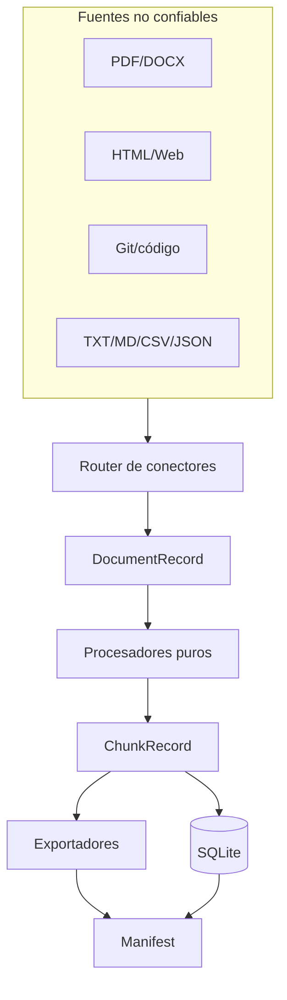
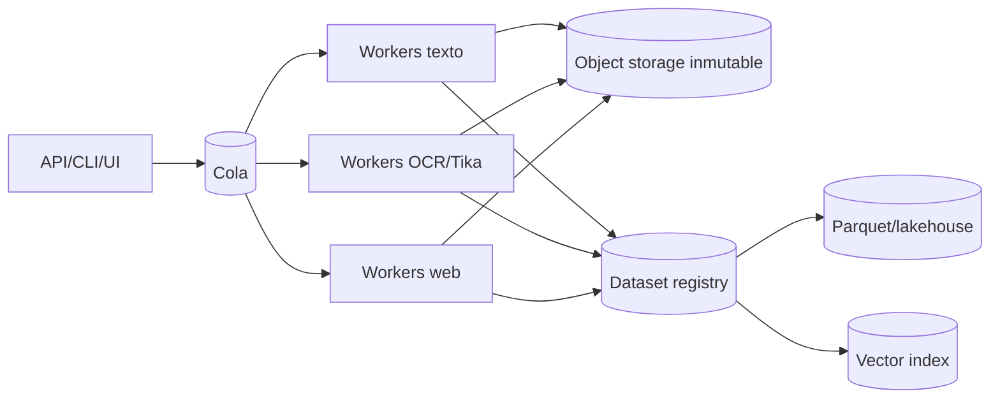

# Arquitectura

## Principio rector

La adquisición de una fuente y la preparación de un dataset son problemas distintos. Cada conector traduce su modalidad a `DocumentRecord`; desde ese punto, el pipeline común opera sin saber si el texto vino de una página PDF, una fila CSV o un archivo Git.

## Capas

| Capa | Responsabilidad | Contrato |
| --- | --- | --- |
| `connectors` | localizar, abrir y extraer | `list[DocumentRecord]` |
| `processors` | normalizar, limpiar, chunk, dedup, calidad | funciones deterministas |
| `pipeline` | orquestar, aislar errores, contar y manifestar | `(records, manifest)` |
| `exporters` | serializar el mismo conjunto lógico | rutas de artefactos |
| `storage` | catálogo consultable local | SQLite transaccional |
| `webapp` | API loopback, uploads y descargas | HTTP local |
| `desktop` | ventana Windows sobre la webapp | mismo frontend/API |

## Modelo de dominio

`SourceInfo` identifica clase, localizador, título y licencia opcional. `DocumentRecord` representa una unidad extraída —una página PDF, fila o archivo— con metadata y hash de fuente. `ChunkRecord` representa contenido final, enlaza al documento y añade hash de contenido y decisión de calidad.

La relación explícita evita que un modelo reciba texto sin origen y permite retirar o reconstruir fragmentos cuando cambia una fuente.

## Invariantes

- Nunca sobrescribir originales.
- Usar IDs estables derivados de identidad, posición y contenido.
- Preservar estado/error por input; una fuente fallida no borra las válidas.
- Exportar únicamente registros aceptados.
- Mantener equivalencia lógica entre formatos.
- No ejecutar macros, scripts ni código adquirido.
- Escuchar en `127.0.0.1` por defecto; exponer la UI requiere un diseño de autenticación separado.

## Extensión de conectores

Un conector nuevo debe definir detección, extracción, granularidad, metadata, hashing, encoding, límites, errores y seguridad. Se registra en `connectors/router.py` y añade fixtures de fuente válida, vacía y malformada.

## Escalado futuro

Docker tendrá sentido en esta etapa para aislar Tika/OCR, object storage, colas y bases; no es requisito artificial del pipeline local.

## Decisiones registradas

- Python: ecosistema documental/ML amplio y distribución directa.
- Pydantic: configuración validada y límites declarativos.
- JSONL: streaming, interoperabilidad y diffs razonables.
- SQLite: catálogo cero-operación para demo local.
- FastAPI + vanilla UI: API tipada y frontend pequeño.
- pywebview: aplicación Windows reutilizando la UI localhost.
