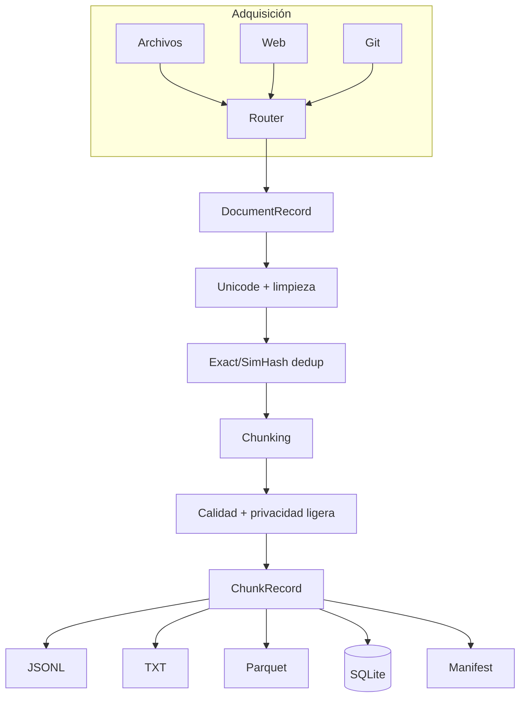
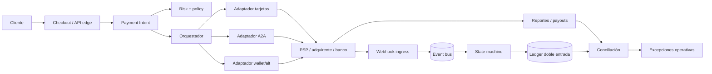

# Arquitectura

## Dos arquitecturas, un contrato limpio

El repositorio contiene un motor operativo de datasets y un caso de referencia sobre pagos. La frontera es intencional: el core procesa `DocumentRecord` y `ChunkRecord`; no importa SDK de un PSP ni interpreta PAN. Los documentos de pago enseñan una arquitectura de producción, pero no la declaran implementada.

## Foundry operativa

### Capas y responsabilidades

1. `connectors/`: traduce fuentes a documentos y conserva localizador, tipo, metadatos y hash.
2. `processors/`: transformaciones deterministas sin I/O externo.
3. `pipeline.py`: orquesta, aísla errores por input y construye el manifiesto.
4. `exporters/` y `storage/`: materializan el contrato de salida.
5. `cli.py`: experiencia de operador; no contiene reglas de procesamiento.

### Invariantes

- Los originales no se modifican.
- Los IDs derivan de fuente, posición y contenido para ser estables.
- Un input fallido no invalida los demás; queda registrado en `ingestion_errors`.
- Solo chunks aceptados entran a exportación.
- Los formatos de salida representan el mismo conjunto lógico.

## Arquitectura de referencia para pagos

### Bounded contexts

| Contexto | Posee | No debe poseer |
| --- | --- | --- |
| Checkout | selección y consentimiento | saldo contable |
| Payment orchestration | intentos, routing, referencias | pedido comercial completo |
| Risk | señales, reglas, decisiones versionadas | verdad de settlement |
| Connector/adapters | traducción al proveedor | política global de negocio |
| Ledger | asientos y balances | llamadas a PSP |
| Reconciliation | matching y excepciones | mutación silenciosa de asientos |
| Disputes | casos, plazos, evidencia | secretos de autenticación |

## Contratos de datos recomendados

Todo comando incluye `command_id`, `idempotency_key`, `occurred_at`, importe entero, moneda ISO 4217 cuando aplique, referencia de negocio y versión de esquema. Todo evento incluye `event_id`, `aggregate_id`, secuencia/version, estado nativo, estado normalizado y procedencia.

No uses una tabla `payments` con un booleano `paid`. Separa:

- `orders` y obligaciones comerciales;
- `payment_intents` y monto objetivo;
- `payment_attempts` y cada interacción con un proveedor;
- `provider_events` como inbox idempotente;
- `ledger_transactions` y `ledger_entries` append-only;
- `settlement_batches`, `payouts` y `reconciliation_items`;
- `refunds`, `returns` y `disputes`.

## Consistencia y mensajería

Dentro de una base, persiste cambio de estado y evento de salida con transactional outbox. Para entrada, usa inbox único por proveedor/evento. Publica eventos at-least-once y diseña consumidores idempotentes. No prometas exactly-once distribuido: demuestra efecto-una-vez mediante restricciones, claves y reconciliación.

## Resiliencia

- timeout por fase y presupuesto total;
- retry solo para error transitorio y operación idempotente;
- circuit breaker por dependencia/operación;
- bulkheads para que un proveedor no agote workers;
- backpressure y DLQ observable;
- degradación: retirar un medio sin tumbar checkout;
- consulta/reconciliación para resultado ambiguo.

## Escalado y datos

Particiona por merchant/aggregate sin romper ordering requerido. Separa OLTP financiero de analytics. Los balances se derivan de entradas inmutables y pueden mantener snapshots comprobables. Cifra datos en tránsito y reposo; tokeniza credenciales; aplica retención por categoría.

## Evolución productiva de la foundry

OCR/Tika, almacenamiento de objetos inmutable, registro PostgreSQL, colas, workers distribuidos, DVC/lakeFS, anotación, evaluaciones y modo air-gapped son extensiones razonables. Docker será útil cuando existan esos servicios o sandboxes; no aporta evidencia nueva al pipeline local actual.
