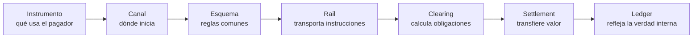

# Fundamentos de sistemas de pago

## La distinción que evita diseños equivocados

Un pago no es una llamada API. Es un proceso por el cual una obligación económica cambia de estado y, finalmente, dos o más instituciones registran posiciones compatibles. La interfaz que ve el cliente es solo el borde visible.



| Concepto | Pregunta que responde | Ejemplo |
| --- | --- | --- |
| Instrumento | ¿Con qué paga? | efectivo, tarjeta de débito, transferencia |
| Canal | ¿Dónde inicia? | POS, web, app, QR, sucursal, ATM |
| Credencial | ¿Qué identifica o habilita? | token, cuenta, PAN, alias, llave pública |
| Esquema | ¿Qué reglas comparten los participantes? | esquema de tarjetas o transferencias |
| Rail | ¿Por qué infraestructura viaja la instrucción? | ACH, red de tarjetas, RTGS, red DLT |
| Clearing | ¿Quién debe cuánto a quién? | neteo bilateral/multilateral o cálculo bruto |
| Settlement | ¿Cuándo y sobre qué activo se extingue la obligación? | dinero de banco central o comercial |
| Ledger | ¿Qué saldo y deuda reconoce cada sistema? | subledger del PSP y mayor contable |

## Actores esenciales

- **Pagador y beneficiario**: originan y reciben valor; pueden ser persona, comercio, empresa o gobierno.
- **Merchant of record**: entidad contractual que vende, fija devoluciones, emite documentos y asume disputas.
- **PSP/gateway/orquestador**: abstrae proveedores, tokeniza, enruta y presenta una API; no necesariamente mueve fondos.
- **Adquirente**: contrata al comercio y presenta transacciones al esquema en modelos de tarjeta.
- **Emisor**: mantiene la relación con el titular y decide autorizaciones o disponibilidad de fondos.
- **Esquema o red**: fija reglas, mensajes, interoperabilidad, fees y proceso de disputas.
- **Procesador**: ejecuta autorización, switching, clearing u otras funciones por cuenta de participantes.
- **Cámara/ACH**: compensa instrucciones y determina posiciones.
- **Agente de liquidación/RTGS**: mueve el activo de liquidación entre participantes.
- **Banco patrocinador**: habilita acceso regulado a actores que no participan directamente.

Los roles pueden concentrarse en una empresa o distribuirse entre varias. Nunca deduzcas responsabilidad a partir de un logo: contrasta contrato, licencia, flujo de fondos y reglas del esquema.

## Cuatro propiedades que cambian todo

### Push frente a pull

En un pago **push**, el pagador ordena enviar fondos; en uno **pull**, el beneficiario inicia un cargo bajo un mandato o credencial. Push reduce ciertos reclamos de «no autorizado», pero incrementa fraude por engaño al pagador. Pull habilita recurrencia, pero exige mandato, revocación y gestión de devoluciones.

### Tiempo real frente a diferido

«Instantáneo» puede describir la confirmación al usuario, el clearing o el settlement. Debe especificarse qué ocurre en segundos y qué queda pendiente. Un checkout puede aprobar de inmediato y liquidar al comercio días después.

### Bruto frente a neto

RTGS liquida instrucciones una a una; un esquema neto compensa obligaciones y liquida saldos. El neteo ahorra liquidez, pero acumula exposición hasta la ventana de liquidación.

### Finalidad frente a reversibilidad

Finalidad jurídica del settlement, disponibilidad comercial del saldo y derecho del consumidor a disputar son conceptos distintos. Incluso tras liquidar, puede nacer una nueva obligación por reembolso, devolución o chargeback.

## Los dos planos de una plataforma

El **plano de control** administra comercios, credenciales, reglas de routing, riesgo, límites y configuración. El **plano de datos** procesa intentos, eventos, balances y archivos de conciliación. Separarlos reduce el blast radius y permite permisos distintos.

## Modelo mental mínimo de estados

```text
CREATED → REQUIRES_ACTION → AUTHORIZED → CAPTURED → SETTLING → SETTLED
    └→ FAILED              └→ VOIDED      └→ RETURNED
                            CAPTURED/SETTLED → PARTIALLY_REFUNDED → REFUNDED
                            CAPTURED/SETTLED → DISPUTED → WON | LOST
```

No todos los rails tienen autorización/captura ni todos admiten void. El modelo común debe conservar estados propios del proveedor en vez de aplastarlos hasta perder información.

## Preguntas de comprobación

1. ¿En qué momento exacto tu producto promete al cliente que el pago terminó?
2. ¿Qué fuente externa e interna prueba esa afirmación?
3. ¿Quién absorbe fraude, devolución, FX y falta de liquidez?
4. ¿Qué sucede si la respuesta HTTP se pierde después de que el proveedor aceptó la orden?
5. ¿Cómo distingues dinero disponible, pendiente, reservado y adeudado?

Continúa con el [atlas de medios](PAYMENT_METHODS.md) y el [ciclo completo](PAYMENT_LIFECYCLE.md).
