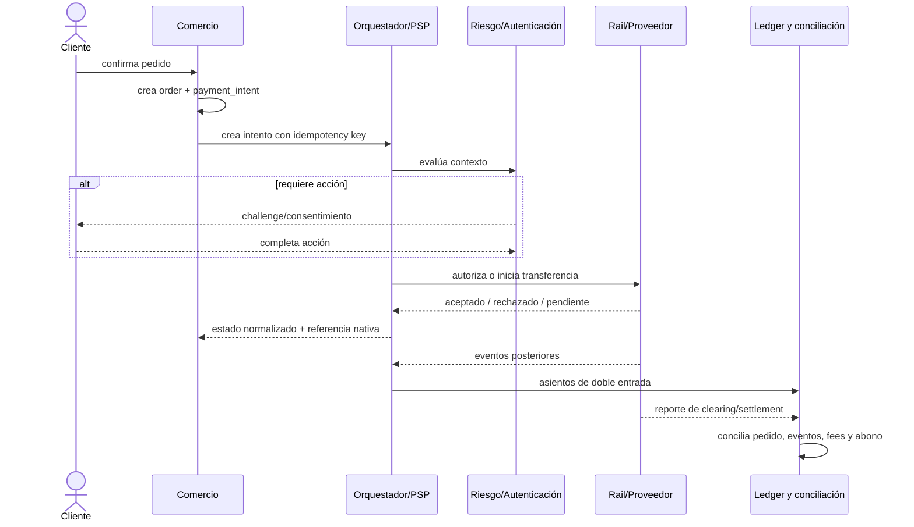

# Ciclo de vida de un pago

## Una compra, varias verdades



## 1. Pedido e intención

El `order` expresa la obligación comercial; `payment_intent` expresa el objetivo de cobrar una cantidad y moneda. Un pedido puede tener varios intentos por retry o cambio de medio, pero no debe contabilizarse dos veces.

Contrato mínimo recomendado:

```json
{
  "payment_intent_id": "pi_demo_01",
  "order_id": "ord_demo_01",
  "amount_minor": 25990,
  "currency": "CLP",
  "method_family": "account_transfer",
  "customer_reference": "cus_synthetic_01",
  "idempotency_key": "checkout-ord_demo_01-v1"
}
```

Usa unidades menores enteras y una tabla por moneda: no todas tienen dos decimales. No serialices dinero con `float`.

## 2. Selección, tokenización y autenticación

La UI recoge consentimiento y una credencial minimizada. Para tarjetas, prefiere una superficie alojada/tokenizada; para cuentas, redirect, decoupled flow o autorización del banco. Autenticación prueba un factor o identidad; autorización financiera decide si la transacción puede continuar.

## 3. Riesgo y autorización

Riesgo combina señales de cuenta, dispositivo, comercio, comportamiento, importe y velocidad. La decisión puede ser `allow`, `challenge`, `review` o `deny`. Guarda versión de reglas y motivos explicables; no registres secretos.

Una autorización de tarjeta reserva o compromete capacidad de pago, pero no necesariamente mueve fondos. Una transferencia push puede saltar el modelo auth/capture y quedar `pending` hasta confirmación del rail.

## 4. Captura, anulación y expiración

Captura solicita presentar el cargo al clearing. Puede ser inmediata, diferida o parcial. `Void` libera una autorización antes de captura cuando el esquema lo permite. Refund crea un movimiento compensatorio después; no es sinónimo de void.

Invariantes:

- suma capturada ≤ suma autorizada, salvo reglas explícitas;
- suma reembolsada ≤ suma capturada;
- cada comando se aplica una vez de forma efectiva aunque llegue repetido;
- el estado normalizado nunca borra el estado y código nativos.

## 5. Clearing y settlement

Clearing valida/presenta transacciones y calcula obligaciones. Settlement descarga esas obligaciones mediante movimientos entre participantes. Payout es el abono que el PSP hace al comercio; puede agrupar muchos settlements y descontar fees, reservas, refunds o chargebacks.

```text
importe bruto
- descuentos/refunds
- fees del proveedor/esquema
- impuestos/retenciones aplicables
- reservas/holdbacks
- chargebacks/ajustes
= payout neto esperado
```

## 6. Ledger

El ledger financiero debe ser append-only y de doble entrada. Los estados operativos se pueden corregir; los asientos publicados se revierten con nuevos asientos.

Ejemplo conceptual de captura por 10.000 y fee 300:

| Cuenta | Débito | Crédito |
| --- | ---: | ---: |
| fondos por cobrar al PSP | 10.000 | 0 |
| ingreso/obligación de la venta | 0 | 10.000 |
| gasto por fee | 300 | 0 |
| fondos por cobrar al PSP | 0 | 300 |

La contabilidad exacta depende de si la plataforma es principal, agente, marketplace o merchant of record.

## 7. Eventos y consistencia

Webhooks pueden duplicarse, retrasarse y llegar fuera de orden. Procesa así:

1. verifica firma sobre bytes crudos y ventana temporal;
2. persiste `event_id` con restricción única;
3. responde rápido y procesa en cola;
4. aplica una transición válida o consulta el recurso al proveedor;
5. registra correlación y resultado sin datos sensibles;
6. reintenta con backoff y DLQ; permite replay controlado.

## 8. Conciliación

Concilia al menos tres vistas: intentos internos, eventos/transacciones del proveedor y movimientos bancarios/payouts. Clasifica diferencias: timing, fee, FX, refund, disputa, duplicado, transacción huérfana o falta de reporte. Ninguna diferencia desaparece por editar un CSV; se resuelve con evidencia y asiento de ajuste aprobado.

## 9. Refunds, returns y disputas

Un refund lo inicia el comercio; un return suele venir del rail; un chargeback/disputa lo inicia el titular o emisor bajo reglas. Cada uno tiene plazos, evidencia y accounting distintos. Conserva pedido, aceptación, entrega, comunicaciones, autenticación y refund policy con retención justificada.

## 10. Fallos ambiguos

El caso crítico es timeout después de enviar. El cliente no sabe si el proveedor procesó. No crees un segundo intento ciego: reusa idempotency key, consulta por referencia y deja estado `UNKNOWN/PENDING_RECONCILIATION` hasta obtener evidencia.

## Reto verificable

Modela una compra con autorización parcial, captura parcial, refund y webhook duplicado. El resultado debe mantener invariantes monetarias, producir asientos balanceados, conservar referencias nativas y terminar con cero eventos sin clasificar.
