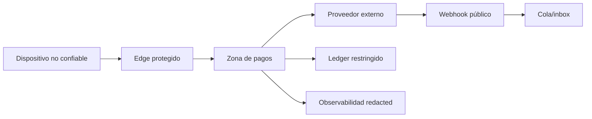

# Modelo de seguridad para pagos y datasets

## Activos

Credenciales de pago, tokens, secretos de API/webhook, claves criptográficas, datos personales/KYC, saldos, instrucciones, asientos, reglas de riesgo, configuración de routing, reportes y evidencia de disputa. En la foundry también son activos los originales, manifests y datasets derivados.

## Fronteras de confianza

Cada flecha exige autenticación, autorización, integridad, replay defense y telemetría proporcionada.

## Amenazas prioritarias

| Amenaza | Ejemplo | Controles principales |
| --- | --- | --- |
| Robo de credencial | PAN/token/API key en logs | hosted capture, tokenización, allowlist de logs, DLP |
| Payment tampering | cliente cambia importe | precio server-side, firma/lookup de orden |
| Replay/doble cobro | retry o webhook repetido | idempotencia, nonce/event ID, constraints |
| Account takeover | atacante usa cuenta válida | MFA/passkeys, risk-based auth, session binding |
| Fraude CNP | credencial robada | 3DS, token, velocity, device/behavior signals |
| APP/social engineering | usuario autoriza al estafador | confirmación de beneficiario, cooling-off, warnings |
| Magecart/e-skimming | JS roba datos | hosted fields, CSP, SRI cuando aplique, inventory/change control |
| Webhook spoofing | falso `payment.succeeded` | firma en bytes crudos, timestamp, consulta al proveedor |
| Insider/admin abuse | cambia payout account | RBAC/ABAC, maker-checker, JIT, audit trail |
| Supply chain | paquete o Action comprometida | pinning, SBOM, provenance, scanning y revisión |
| Data poisoning | fuente manipulada entra al corpus | allowlist, hashes, provenance, revisión y quarantena |

## PCI y minimización

PCI DSS aplica a entidades que almacenan, procesan o transmiten cardholder data/sensitive authentication data o pueden afectar el entorno. La arquitectura debe evitar que la aplicación toque datos de tarjeta mediante páginas/campos alojados y tokens. El SAQ y alcance correctos dependen del flujo real; no se deducen de usar un SDK.

Nunca almacenar después de autorización: CVV/CVC, PIN/PIN block o full track data. PAN requiere protección y visualización enmascarada. Este repositorio prohíbe todos esos datos, incluso sintéticos con formato convincente.

## Criptografía y secretos

- TLS moderno y verificación de certificados; mTLS cuando el rail lo exige.
- KMS/HSM para claves relevantes; envelope encryption para datos.
- Separación por ambiente/tenant/propósito y rotación ejercitada.
- Secret manager, identidades de workload y credenciales de corta vida.
- Firma con algoritmo allowlisted; nunca «si falla, acepta».
- Hash no es cifrado ni anonimiza PAN, email o identificadores predecibles.

## Identidad y autorización

Menor privilegio, deny-by-default, MFA resistente a phishing para admins, acceso JIT, maker-checker para cuenta de payout/refunds altos, segregación entre desarrollo y producción, revisión periódica y sesiones grabadas donde corresponda.

## Logging seguro

Permitir: IDs internos, proveedor, familia, moneda, rango normalizado, latencia, resultado categórico y versión. Prohibir: PAN, CVV, track, PIN, access/refresh tokens, secretos, payload KYC, cookie/sesión y body no filtrado. Tokeniza o seudonimiza identificadores con clave rotatable cuando necesitas correlación.

## Seguridad de la foundry

- Procesa solo fuentes autorizadas.
- Revisa licencias y PII antes de ingesta.
- Trata HTML/documentos como entrada hostil; no ejecuta macros ni scripts.
- Aísla parsers complejos en una evolución futura.
- Mantén output fuera de Git y controla acceso a originales.
- El detector ligero no reemplaza scanning especializado.

## Respuesta a incidentes

Contén credenciales, preserva evidencia, identifica transacciones/tenants afectados, coordina proveedor/adquirente/banco, aplica obligaciones de notificación, reconcilia impacto financiero, rota secretos y prueba la corrección. Nunca «soluciones» un incidente borrando trazas necesarias.

Fuente PCI oficial y estándares relacionados: [`REFERENCES.md`](REFERENCES.md).
