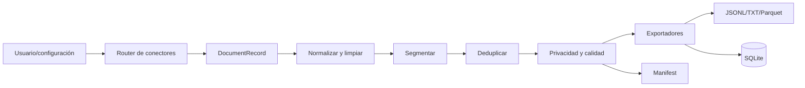

# 01. Descripción general del sistema

## Qué es y qué problema resuelve

AI Dataset Foundry 0.2.0 es una aplicación Python local-first con CLI, API/UI localhost, host de escritorio Windows y una edición Android mínima. Adquiere archivos, páginas y repositorios; transforma su contenido en fragmentos normalizados; elimina duplicados; aplica controles básicos de privacidad/calidad; y exporta JSONL, texto, Parquet opcional, SQLite y un manifest de trazabilidad.

Está dirigida a ingeniería de datos/ML, investigación y equipos que necesitan preparar corpus antes de entrenar, ajustar, recuperar o evaluar modelos. No entrena modelos, no genera etiquetas SFT, no crea embeddings y no decide si una fuente es legal o verdadera.

## Casos de uso y actores

- **Curador:** selecciona fuentes autorizadas y configuración.
- **Ingeniero:** ejecuta `foundry build`, integra JSONL/Parquet y revisa el manifest.
- **Auditor:** rastrea un chunk a su localizador y SHA-256 de origen.
- **Operador local:** usa la web en loopback o el ejecutable Windows.
- **Usuario Android:** procesa offline texto, Markdown, JSON y CSV con alcance menor.

Entradas comprobadas: archivos textuales/código, JSON/JSONL, CSV, PDF con texto, DOCX, HTML, URL HTTP(S), repositorios Git y directorios. Salidas: registros `ChunkRecord`, artefactos, catálogo SQLite y manifest. PDF/DOCX/web/Parquet/UI requieren extras; Git remoto requiere el ejecutable Git.

## Flujo general

Los errores de adquisición se capturan por locator y se registran; los errores posteriores pueden abortar la ejecución. Los IDs y hashes se calculan de forma determinista, mientras `generated_at` y el identificador de una ejecución web cambian por corrida.

## Tecnologías, límites y estado

Núcleo: Python 3.11+, Pydantic, Typer, Rich y PyYAML. Integraciones opcionales: pypdf, python-docx, Requests, Trafilatura/BeautifulSoup, PyArrow, FastAPI/Uvicorn y pywebview. Persistencia: biblioteca estándar `sqlite3`; UI: HTML/CSS/JavaScript sin framework; Android: Java/Gradle.

Estado observado: núcleo, interfaz local, artefactos y release 0.2.0 están implementados y cubiertos por smoke/CI. OCR, rastreo web, registro incremental, procesamiento distribuido, RBAC, DLP, object storage y observabilidad son roadmap.

## El sistema explicado para una persona no técnica

Imagine una fábrica que recibe carpetas, documentos y páginas. Primero abre cada fuente y anota de dónde vino; después limpia el texto, lo corta en piezas útiles, descarta copias y piezas problemáticas, y empaca el resultado en formatos que otro programa puede leer. Además entrega una guía de envío —el manifest— para saber qué entró, qué salió y qué se rechazó. La fábrica ayuda a ordenar y rastrear; no certifica que el contenido sea correcto, imparcial o autorizado.
