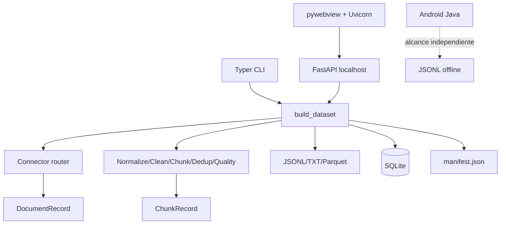
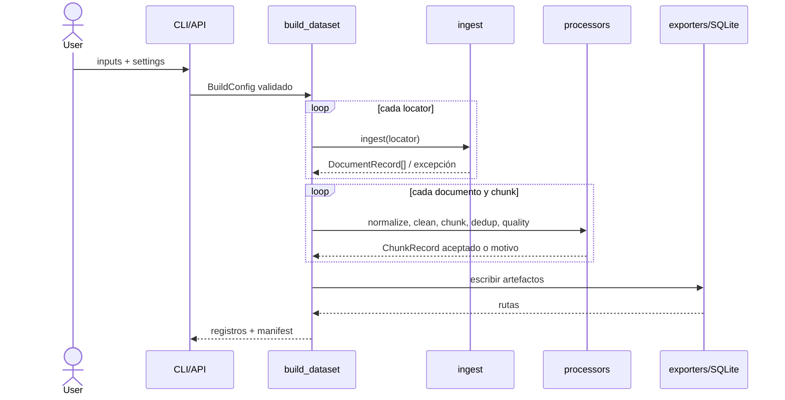
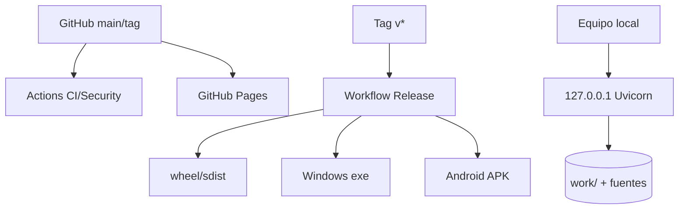

# 03. Arquitectura

## Estilo y capas

El proyecto usa una arquitectura de pipeline/puertos ligera. `connectors` adapta fuentes a `DocumentRecord`; `processors` opera sobre texto; `exporters` y `storage` materializan resultados; `pipeline.build_dataset` coordina. CLI, API y escritorio son adaptadores de entrada que reutilizan el mismo núcleo. Las importaciones diferidas aíslan extras opcionales.

No existe contenedor DI, bus de eventos, cola, caché, scheduler ni estado compartido de aplicación. El estado de deduplicación vive durante un build; la UI persiste ejecuciones en `work/ui-runs` y no implementa limpieza automática.

## Secuencia principal

Los locators fallidos se aíslan. La escritura de exportadores y SQLite no tiene transacción común: una excepción puede dejar artefactos parciales. SQLite usa la transacción del contexto de conexión y `WAL`; cada escritura borra/reemplaza el catálogo en esa ruta.

## Despliegue

Autenticación/autorización no aplican al modo local confiable y no están implementadas. El control principal es bind loopback; CORS/CSRF explícitos no existen. El frontend y Windows consumen la API local; Android reimplementa un subconjunto, por lo que existe riesgo de divergencia.

## Patrones y decisiones

- DTOs/dataclasses para contratos internos; Pydantic para configuración.
- Strategy por funciones para chunking y conectores por extensión.
- IDs estables `prefix + SHA-256 truncado`; hashes completos para provenance.
- Fail-soft sólo en adquisición y lectura Git de archivos individuales.
- Lazy imports para degradación controlada de extras.
- Síncrono en núcleo; FastAPI deriva el build a thread para no bloquear el event loop.
