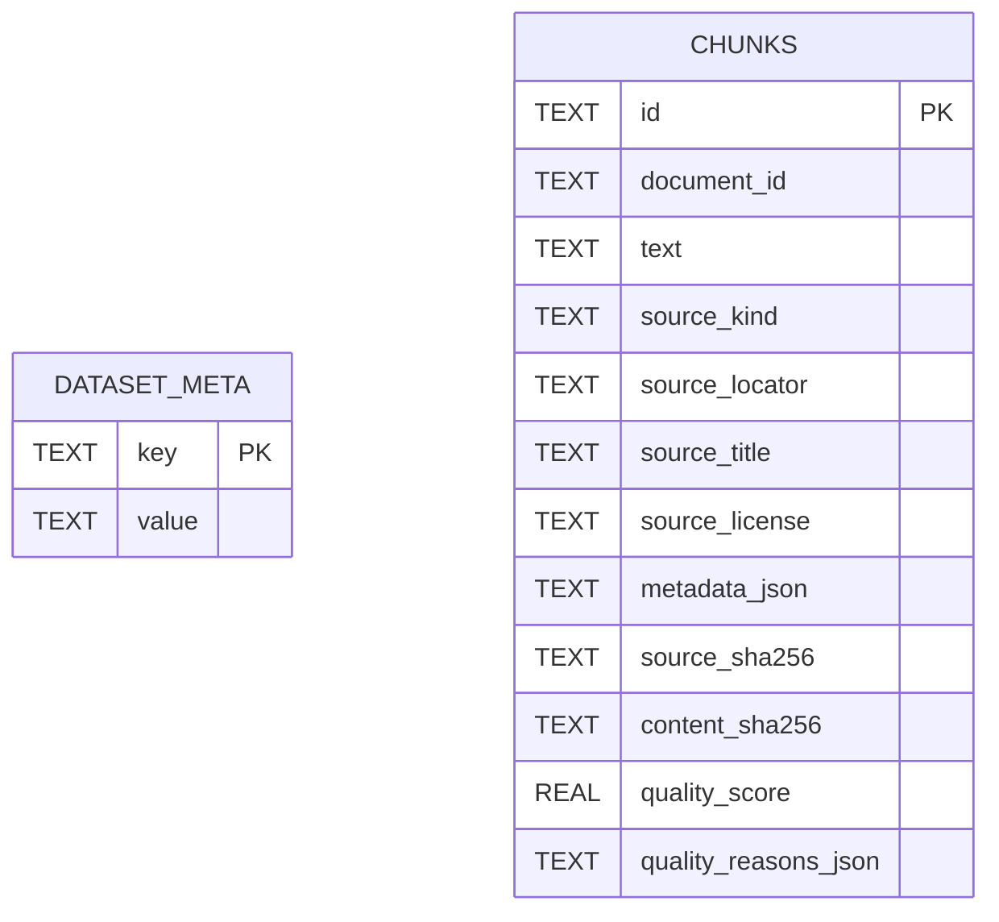

# 07. Base de datos y persistencia

El mecanismo persistente implementado es SQLite, archivo `dataset.sqlite`, escrito con `sqlite3`. No hay servidor, ORM, migraciones versionadas, seeds, vistas, triggers, procedimientos, cifrado ni backups automáticos. `PRAGMA journal_mode=WAL` se solicita al crear la conexión. Cada build sobre la misma ruta elimina y reemplaza filas; los originales permanecen fuera de la DB.

No existe FK entre tablas: `dataset_meta` describe el conjunto y `chunks` almacena filas independientes. `document_id` está indexado pero no referencia una tabla de documentos.

## Diccionario de datos

| Tabla.campo | Tipo/regla | Origen y uso |
| --- | --- | --- |
| `dataset_meta.key` | TEXT PK | actualmente `manifest` |
| `dataset_meta.value` | TEXT NOT NULL | JSON del manifest |
| `chunks.id` | TEXT PK | `stable_id("chunk", document_id,index,content_hash)` |
| `document_id` | TEXT NOT NULL, índice | ID del `DocumentRecord` |
| `text` | TEXT NOT NULL | fragmento limpio; puede contener información sensible no detectada |
| `source_kind` | TEXT NOT NULL, índice | tipo de conector |
| `source_locator` | TEXT NOT NULL | ruta/URL/repo; puede revelar ubicaciones locales |
| `source_title`, `source_license` | TEXT nullable | metadatos disponibles; licencia suele requerir curación |
| `metadata_json` | TEXT NOT NULL | JSON específico de conector + `chunk_index` |
| `source_sha256` | TEXT NOT NULL | hash de bytes de la fuente |
| `content_sha256` | TEXT NOT NULL, índice | hash del chunk transformado |
| `quality_score` | REAL NOT NULL | 0..1 según reglas actuales |
| `quality_reasons_json` | TEXT NOT NULL | razones/flags JSON |

`write_sqlite` es el único escritor. El contexto de conexión confirma al salir y revierte ante excepción. No hay lecturas en la aplicación actual: SQLite funciona como catálogo interoperable. Respaldo/recuperación: no documentado; al ser derivado, se recomienda conservar fuentes/config/manifest y regenerar, o copiar el archivo con herramientas SQLite seguras. Los hashes detectan identidad, no prueban autoría ni integridad criptográfica del conjunto porque no hay firma.
