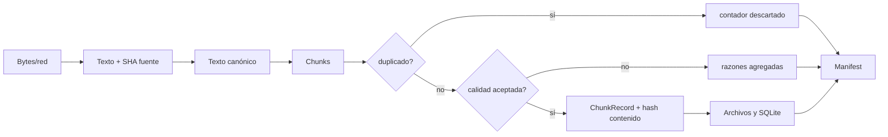

# 08. Flujo de datos

## Origen a consumo

| Etapa | Datos | Validación/transformación | Riesgo |
| --- | --- | --- | --- |
| Entrada | rutas, URLs, repos, uploads | existencia, extensión/router; JSON/CSV/parsers | fuentes hostiles, SSRF si se expone la API, archivos grandes |
| Documento | texto + source + metadata + SHA | adaptador específico | pérdida de layout/encoding/licencia |
| Normalización | Unicode NFKC, saltos, espacios | regex y `unicodedata` | cambios semánticos en casos Unicode delicados |
| Limpieza | NUL, controles, líneas repetidas | reglas deterministas | falsos positivos en contenido intencional |
| Chunking | fragmentos | estrategia/tamaño | pérdida de contexto; overlap sólo fixed |
| Dedup | SHA exacto + SimHash | umbral configurable | falsos positivos, orden, costo O(n²) |
| Calidad | longitud/controles/secreto/email | score y razones | detector incompleto; email no se rechaza |
| Salida | JSONL/TXT/Parquet/SQLite/manifest | serializers | artefactos parciales y datos sensibles persistentes |

Los datos enviados a servicios externos son únicamente las solicitudes HTTP a la URL elegida y el clone Git al host elegido. No hay telemetría ni API de IA. Pages/CI operan sobre el repositorio público, no sobre corpus locales.

Datos presentados al usuario: conteos, rechazos, errores de ingestión y nombres descargables; los artefactos contienen el texto completo. La UI guarda uploads y outputs bajo `work/ui-runs`; no se observa política automática de expiración. Rutas/URLs, emails y posibles secretos pueden quedar en outputs o manifest. `reject_secrets` sólo filtra patrones limitados; la autorización, minimización, retención y borrado corresponden al operador.

Ejemplo seguro: `examples/sample.txt` → `DocumentRecord` con hash → chunks aceptados → `dataset.jsonl` y `dataset.sqlite` → `manifest.json`. La prueba smoke confirma este camino sin contenido privado.
