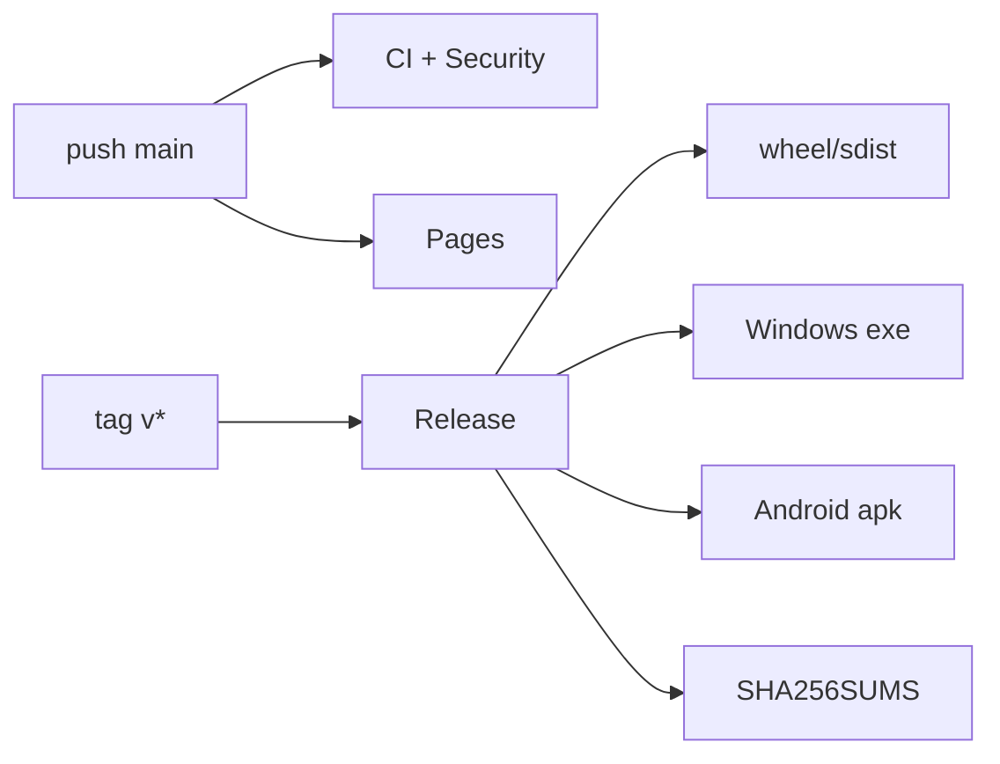

# 13. Despliegue y operación

No hay infraestructura cloud de aplicación. Los entornos observados son desarrollo local, GitHub Actions, GitHub Pages, release Windows y release Android. Python se empaqueta como wheel/sdist; Windows mediante PyInstaller/launcher; Android mediante Gradle; los releases incluyen checksums.

Los logs son stdout/stderr de CLI/Uvicorn/Actions y errores del manifest. No hay métricas, tracing, alertas, backups automáticos, migraciones ni rollback automatizado. Rollback de código: desplegar un commit/tag conocido; datos: regenerar desde fuentes/config conservadas.

## Procedimiento operativo

1. Ejecutar `doctor.py`; confirmar disco, permisos y fuentes autorizadas.
2. Usar un `out_dir` dedicado y mantener UI en loopback.
3. Ejecutar build y revisar errores, rechazos, conteos y outputs del manifest.
4. Muestrear contenido/provenance y validar derechos/PII fuera de la herramienta.
5. Guardar configuración, manifest, hashes y versión junto al dataset.
6. Para release, exigir CI/Security verdes, tag coherente y checksums.
7. Aplicar retención manual a `work/` hasta implementar TTL/cuotas.

SLA/LTS, on-call, RPO/RTO y observabilidad productiva no están documentados. El proceso es de laboratorio local, no de servicio compartido. Consulte `docs/RUNBOOK.md` y los workflows.
